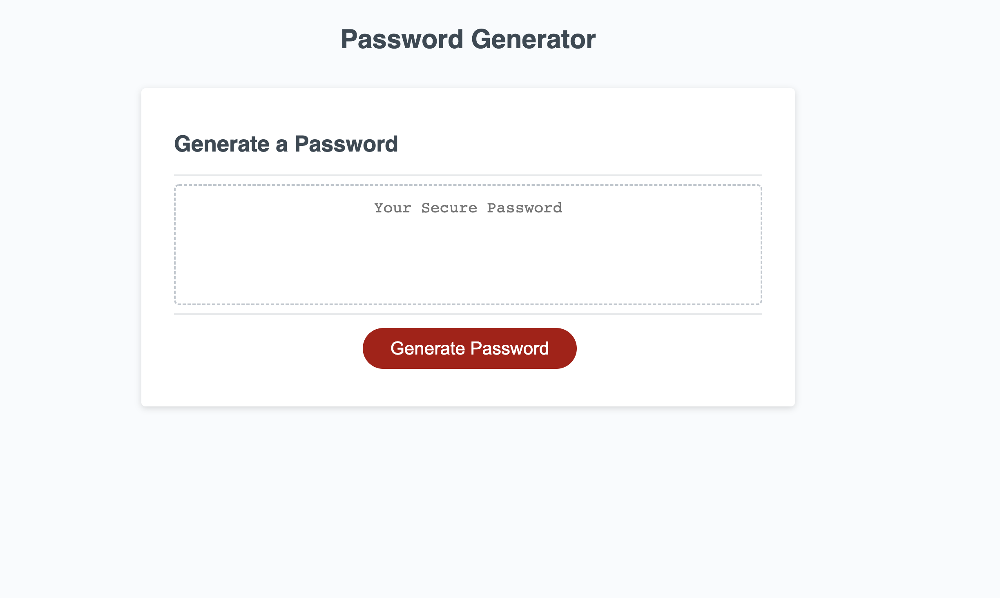

# Generate Password 

Week 3 Homework Assignment

## Description

For this assignment we had create an application that will generate a random password after it asked us a series of questions.

I had to edit the Javascript page to make it user interactive. During this project I added an alert box, some confirm prompts, I had to create variables, I created strings, if/ else statements, and I used a while loop. This project will allow the user to decided if they want a password between the length of 8-128 characters and it could include capatial letters, lowercase, special characters, and/or numbers. 

## Screenshot

## Live URL
 https://grady253.github.io/generate-password/
## Contact Me
Email: Grady.andre2@gmail.com 
